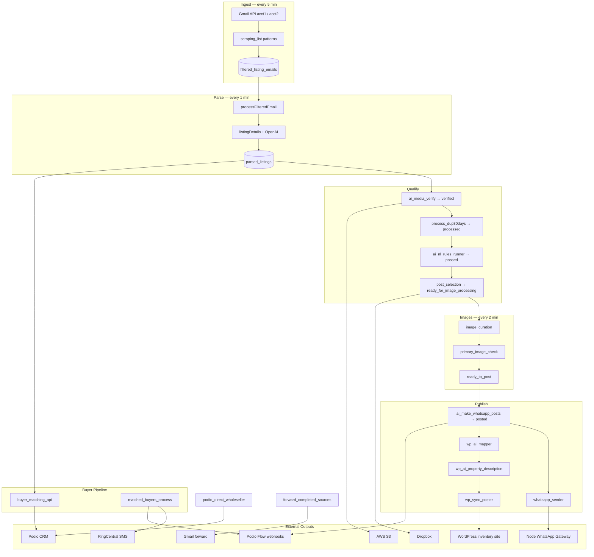

# RichListings Python Application — Architecture

This document describes the end-to-end architecture of the Python worker (`py_RichListings`): how wholesaler listing emails are ingested, processed, qualified, published, and how downstream outputs are generated.

For integration-specific deep dives, see:

- [Media verification](./media_verify.md)
- [30-day dedup](./dedup_30_day.md)
- [Post selection](./post_selection.md)
- [Image curation](./image_curation.md)
- [WhatsApp ad generation](./whatsapp_ad_generation.md)
- [WhatsApp delivery](./whatsapp.md)
- [WordPress](./wordpress.md)
- [Podio](./podio.md)
- [Scraping list (sender patterns)](./scraping_list.md)
- [Direct wholesalers](./direct_wholesalers.md)
- [Special availability](./special_avail_list.md)

---

## Overview

RichListings is a long-running Python worker that automates South Florida real estate wholesaling operations. It:

1. Polls Gmail accounts for wholesaler blast emails
2. Parses each email into structured property listings
3. Qualifies listings through media verification, deduplication, AI rules, and image curation
4. Publishes qualified listings to WhatsApp, WordPress, and Podio
5. Matches buyers to new listings and sends outbound notifications
6. Tracks special availability snapshots per wholesaler

The system uses **MongoDB** as its primary data store, **OpenAI** for extraction and content generation, and a set of external APIs for distribution.

```
┌─────────────────────────────────────────────────────────────────────────────┐
│                         server_runner.py (main process)                     │
│  ┌──────────────────────┐    ┌──────────────────────────────────────────┐   │
│  │  schedule loop       │    │  FastAPI (api_app.py) — port 8000        │   │
│  │  (every N minutes)   │    │  Health, buyer APIs, config, admin CRUD  │   │
│  └──────────────────────┘    └──────────────────────────────────────────┘   │
└─────────────────────────────────────────────────────────────────────────────┘
         │                                      │
         ▼                                      ▼
    Gmail API                              HTTP clients
    OpenAI                                 (WhatsApp gateway, WP, Podio, etc.)
    MongoDB
    AWS S3 / Dropbox
    Google Maps
    RingCentral
```

---

## Entry Point & Orchestration

| File | Role |
|------|------|
| `server_runner.py` | Primary process: in-process scheduler + background FastAPI thread |
| `api_app.py` | FastAPI app served by `uvicorn` on `STATUS_PORT` (default 8000) |

### How the process runs

1. `init_db()` connects to MongoDB via MongoEngine
2. A daemon thread starts `uvicorn` with `api_app:app`
3. The main thread runs `while True: run_pending(); sleep(1)` using the Python `schedule` library

There is **no Celery, Redis, or system cron**. All jobs are in-process scheduled functions decorated with `@repeat(every(N).minutes)`.

---

## Phase 1 — Email Fetching

### Source

Wholesaler property blast emails arrive in two Gmail accounts (`acct1`, `acct2`). OAuth credentials live under `accounts/<label>/`.

| File | Key functions |
|------|---------------|
| `gmail_hourly_multi.py` | `process_account()`, `gmail_fetch_all()`, `_gmail_search()` |
| `emailExtract.py` | `extract_email_body_simple()` → `{text, html_full, html_ai}` |
| `services/scraping_list_service.py` | `get_patterns_for_account()` — allow/skip sender patterns |

### Fetch flow

```
Gmail API (acct1, acct2)
    │
    ├─ Incremental window from state.json (last_run_epoch)
    │   First run: fallback_lookback_min (60 min)
    │
    ├─ Gmail search: after:<epoch> before:<epoch> [in:inbox]
    │
    ├─ Sender filter (MongoDB scraping_list)
    │   Allow patterns + skip patterns (wildcard/fnmatch on email, domain, name, From header)
    │
    ├─ MIME body extraction → plain text + HTML
    │   html_ai = markdown via html2text + address-link merging
    │
    └─ Upsert → filtered_listing_emails (status: not_processed)
```

### Configuration

| Resource | Location |
|----------|----------|
| Gmail OAuth | `accounts/acct1/`, `accounts/acct2/` — `credentials.json`, `token.json`, `state.json` |
| Sender allow/skip patterns | MongoDB `scraping_list` collection (managed via `/api/scraping-list`) |
| Forward destination | `FORWARD_EMAIL` env var |

### Schedule

| Interval | Job |
|----------|-----|
| Every 5 min | `gmail_fetch_all()` |

---

## Phase 2 — Email → Parsed Listings

| File | Function | Input → Output |
|------|----------|----------------|
| `processFilteredEmail.py` | `process_pending()` | `FilteredListingEmail.not_processed` → `processed` / `error` |
| `listingDetails.py` | `upsert_parsed_listings_from_html()` | Email HTML → `ParsedListing` documents |
| `google_formatter.py` | `get_street_and_city()`, `geocode_response()` | Address normalization via Google Maps |
| `ai_address_search_keys.py` | `update_parsed_listing_address_keys()` | Search-key generation for matching |

### Parsing details

- Atomic lock: email `not_processed` → `processing` → `processed` / `error`
- Uses `html_ai` (or `html_full`) from the stored email body
- **OpenAI structured JSON** extraction (~50+ fields per listing: address, price, beds/baths, ARV, etc.)
- **Direct wholesaler override** from MongoDB `direct_wholesaler` map
- Per-sender listing slice rules (`SENDER_LISTING_SLICES`) — e.g. only listing #1 from certain senders
- Stale recovery: `reset_stale_processing_emails()` every 2 hours

### Schedule

| Interval | Job |
|----------|-----|
| Every 1 min | `process_pending()` |
| Every 2 hours | `reset_stale_processing_emails()` |

---

## Phase 3 — Qualification Pipeline

Listings move through a status machine in `parsed_listings`. Each stage is a scheduled job.

### Stage A — Media verification

See [media_verify.md](./media_verify.md).

| File | Function | Status transition |
|------|----------|-------------------|
| `ai_media_verify.py` | `verify_and_fill_missing_media_for_not_processed()` | `not_processed` → **`verified`** |

- Fills missing `images` / `other_images_source` from source email HTML via AI
- Uploads blocked/hotlink-protected images to **AWS S3** (`boto3`)
- Sets `wp_check = "pending"` for later price/media update tracking

**Schedule:** every 3 min

### Stage B — Duplicate detection (30-day rule)

See [dedup_30_day.md](./dedup_30_day.md).

| File | Function | Status transition |
|------|----------|-------------------|
| `process_dup30days.py` | `process_not_processed_with_duplicate_rule()` | `verified` → **`processed`** or **`skipped`** |

- Same address/city/zip within 30 days → skip unless price dropped ≥ 6%
- Geo-based fallback matching via `geo_code_response`

**Schedule:** every 1 min

### Stage C — AI business rules

| File | Function | Status transition |
|------|----------|-------------------|
| `ai_nl_rules_runner.py` | `apply_ai_english_rules()` | `processed` → **`passed`** or **`skipped`** |
| `ai_nl_rules_judge.py` | `judge_listing_with_english_rules()` | LangChain + OpenAI judge |

Rules defined in `ai_listing_rules.yaml`. Skipped listings record `rules_ai_rule_id`, `rules_ai_reason`.

**Schedule:** every 5 min

### Stage D — Post selection & quotas

See [post_selection.md](./post_selection.md).

| File | Function | Status transition |
|------|----------|-------------------|
| `post_selection.py` | `select_passed_listings_for_post()` | `passed` → **`ready_for_image_processing`**, **`skipped`**, or **`skipped_quota`** |

Policies applied:

- **Do-not-post cities** — `do_not_post_city.json` + AI fuzzy match
- **Region filter** — South Florida tri-county, St. Lucie, Fort Pierce, rest_of_florida
- **35% daily cap** — `rest_of_florida` listings capped vs non-rest (`DailyBaseCount` collection)
- **Dropbox gallery upload** — `other_images_source` → `other_images_dropbox_link` via `dropboxImageUpload.py`

**Schedule:** every 10 min

### Stage E — Image curation

See [image_curation.md](./image_curation.md).

| File | Function | Status transition |
|------|----------|-------------------|
| `image_curation.py` | `process_listings_ready_for_image_processing()` | `ready_for_image_processing` → **`ready_for_primary_image_check`** (or `ready_to_post` if no images) |
| `image_curation.py` | `process_primary_image_verification()` | `ready_for_primary_image_check` → **`ready_to_post`** or **`primary_image_failed`** |

Uses OpenAI vision models to filter/reorder images and validate the primary photo.

**Schedule:** every 2 min (both jobs)

---

## Phase 4 — Publishing & Distribution

### Stage F — WhatsApp ad generation & send

Ad copy: [whatsapp_ad_generation.md](./whatsapp_ad_generation.md). Delivery: [whatsapp.md](./whatsapp.md).

| File | Function | Effect |
|------|----------|--------|
| `ai_make_whatsapp_posts.py` | `make_whatsapp_posts_from_ready_to_post()` | `ready_to_post` → **`posted`**; sets `post_content`, `wp_status=ready_to_process`, `whatsapp_status=pending` |
| `whatsapp_sender.py` | `process_whatsapp_queue()` | `whatsapp_status` pending/failed → **sent** / failed |

WhatsApp copy rules: `ad_post_rules.txt`. Delivery goes through the **Node WhatsApp gateway** (`node_RichWhatsappListings`) via HTTP — see [whatsapp.md](./whatsapp.md).

**Schedule:** every 2 min (ad generation), every 1 min (send queue)

### Stage G — WordPress sync

Runs in parallel after a listing reaches `posted`:

| File | Function | `wp_status` progression |
|------|----------|-------------------------|
| `wp_ai_mapper_catalog_first.py` | `ai_build_wp_payload_for_posted()` | `ready_to_process` → **`keys_generated`** |
| `wp_ai_property_description.py` | `ai_build_wp_property_description_for_posted()` | `keys_generated` → **`description_generated`** |
| `wp_sync_poster.py` | `sync_wp_for_descriptions()` | `description_generated` → **`posted`** (sets `post_id`) |
| `wp_price_red_pic_links.py` | `process_wp_price_and_media_updates()` | Updates existing WP posts for verified listings (`wp_check`) |

WP API base: `WP_API_BASE` → `https://inventory.joinbuyerslist.com/wp-json/addproperty/v1`

See [wordpress.md](./wordpress.md) for details.

**Schedule:** every 3 min (mapper + description), every 5 min (sync), every 2 min (price/media updates)

### Stage H — Podio wholesaler linking

| File | Function |
|------|----------|
| `podio_direct_wholeseller.py` | `process_direct_wholeseller_batch()`, `initialize_direct_wholesaler_flag()` |

Links listings to Podio wholesaler records. See [podio.md](./podio.md).

**Schedule:** every 3 min

### Stage I — Source email forwarding

| File | Function |
|------|----------|
| `forward_completed_sources.py` | `forward_completed_source_emails()` |

Forwards source HTML to `FORWARD_EMAIL` and applies Gmail labels when **all** child `ParsedListing` documents for an email are in a terminal state (`posted`, `skipped`, or `skipped_quota`).

**Schedule:** every 15 min

---

## Phase 5 — Special Availability

Tracks per-wholesaler listing snapshots and matches against Podio active properties.

| File | Functions |
|------|-----------|
| `special_avails.py` | `snapshot_yesterday_special_avail()`, `process_one_special_avail_with_active_listings()`, `process_one_special_avail_matching()`, `process_manny_special_avails()` |

Wholesaler → sender mapping lives in MongoDB `special_avail_list`. Snapshots stored in `special_avail` collection.

**Schedule:** every 3 min (active listings), every 5 min (matching)

**Manual triggers (FastAPI):**

- `POST /tasks/snapshot-yesterday-special-avail`
- `POST /tasks/run-manny-special-avails`

---

## Phase 6 — Buyer Pipeline

A parallel track that matches investor buyers to new listings and sends notifications.

| File | Role |
|------|------|
| `buyer_submissions_api.py` | CRUD for buyer preferences → MongoDB + Podio |
| `buyer_matching_api.py` | `process_pending_buyer_matching_batch()` — AI matching of listings to buyers |
| `matched_buyers_process.py` | `process_pending_buyer_descriptions()`, `process_buyer_sends()` — AI SMS/email copy, RingCentral SMS, email webhooks |
| `buyer_submissions_formatter.py` | Formatting helpers for buyer data |

### Buyer matching flow

```
ParsedListing (posted) → buyer_matching_status: pending
    │
    ├─ AI match against Podio buyer preferences
    │   → matched_buyer_ids, buyer_matching_status: matched
    │
    ├─ Generate buyer_sms_description + buyer_email_description
    │   → buyer_send_status: des_generated
    │
    └─ Send via RingCentral SMS + Podio Flow email webhooks
        → buyer_send_status: sent
```

**Schedule:** every 3 min (matching, configurable), every 5 min (descriptions), every 3 min (sends)

---

## Phase 7 — RingCentral Media Linking

| File | Role |
|------|------|
| `rc_media_linker.py` | Links RingCentral conversation media to WordPress property posts |
| `ringcentral_auth.py` | OAuth/token management for RingCentral |

Exposed as `/rc/*` FastAPI routes. Logs to `rc_media_link_logs` collection.

---

## Listing Status State Machine

```
not_processed
    ↓  (media verify)
verified
    ↓  (30-day dedup)
processed ──→ skipped
    ↓  (AI rules)
passed ──→ skipped
    ↓  (post selection)
ready_for_image_processing ──→ skipped / skipped_quota
    ↓  (image curation)
ready_for_primary_image_check ──→ primary_image_failed / image_curation_failed
    ↓
ready_to_post
    ↓  (WhatsApp ad generation)
posted
```

### Parallel status fields on `ParsedListing`

| Field | Values | Purpose |
|-------|--------|---------|
| `status` | See above | Main pipeline status |
| `wp_status` | `ready_to_process` → `keys_generated` → `description_generated` → `posted` / `failed` | WordPress sync track |
| `whatsapp_status` | `pending` → `sent` / `failed` | WhatsApp delivery track |
| `wp_check` | `pending` → `processed` | Price/media update tracking for already-posted listings |
| `buyer_matching_status` | `none` → `pending` → `processing` → `matched` / `errored_listing` / `skipped` | Buyer matching queue |
| `buyer_send_status` | `pending` → `des_generated` → `sent` / `failed` | Buyer notification delivery |
| `direct_wholeseller` | Podio linking status | Wholesaler CRM link |

---

## All Outputs Generated

| Output | Destination | Triggered by |
|--------|-------------|--------------|
| **MongoDB documents** | All collections (see below) | Entire pipeline |
| **WhatsApp messages** | Node gateway → WhatsApp DM or group | `whatsapp_sender.py` |
| **WordPress property posts** | `inventory.joinbuyerslist.com` REST API | `wp_sync_poster.py`, `wp_price_red_pic_links.py`, `rc_media_linker.py` |
| **Gmail forwards + labels** | Gmail API | `forward_completed_sources.py` |
| **Dropbox shared folders** | Dropbox API | `dropboxImageUpload.py` |
| **S3 image URLs** | AWS S3 bucket | `ai_media_verify.py` |
| **Podio CRM items/fields** | Podio API | `podio_direct_wholeseller.py`, `podio_web_form_submissions.py`, `special_avails.py`, buyer matching |
| **HTTP webhooks (Podio Flow)** | External URLs | Posted/skipped listings, special avail, buyer notifications |
| **RingCentral SMS** | RingCentral REST API | `matched_buyers_process.py` |
| **Buyer update-link emails** | External email API | `buyer_submissions_api.py` → `BUYER_UPDATE_EMAIL_API_URL` |
| **Local OAuth/state files** | `accounts/*/state.json`, `token.json`, `rc_token.json` | Gmail/RC auth refresh |

### Webhook env vars

| Variable | Event |
|----------|-------|
| `POSTED_LISTING_WEBHOOK_URL` | Listing posted to WhatsApp |
| `SKIPPED_LISTING_WEBHOOK_URL` | Listing skipped by rules |
| `SPECIAL_AVAIL_MATCH_WEBHOOK_URL` | Special availability match found |
| `MANNY_MATCH_WEBHOOK_URL` | Manny special-avail matching |
| `BUYER_NON_TEXT_EMAIL_WEBHOOK_URL` | Buyer email notification |
| `POF_EMAIL_API_URL` | Proof-of-funds email |
| `BUYER_UPDATE_EMAIL_API_URL` | Buyer preference update link email |

---

## MongoDB Collections

| Collection | Document class | Purpose |
|------------|----------------|---------|
| `filtered_listing_emails` | `FilteredListingEmail` | Raw ingested emails |
| `parsed_listings` | `ParsedListing` | Structured listings (main pipeline entity) |
| `daily base count` | `DailyBaseCount` | Daily quota tracking for rest_of_florida cap |
| `special_avail` | `SpecialAvail` | Wholesaler availability snapshots |
| `rc_media_link_logs` | `RCMediaLinkLog` | RingCentral media linking audit |
| `web_form_buyer_submissions` | `WebFormBuyerSubmission` | Buyer preference form data |
| `scraping_list` | `ScrapingList` | Gmail sender allow/skip patterns |
| `direct_wholesaler` | `DirectWholesaler` | Wholesaler contact overrides |
| `special_avail_list` | `SpecialAvailList` | Wholesaler → sender mapping for special avails |

---

## Scheduled Jobs Reference

| Interval | Function | Module |
|----------|----------|--------|
| 5 min | `gmail_fetch_all` | `gmail_hourly_multi` |
| 1 min | `process_pending` | `processFilteredEmail` |
| 3 min | `verify_and_fill_missing_media_for_not_processed` | `ai_media_verify` |
| 1 min | `process_not_processed_with_duplicate_rule` | `process_dup30days` |
| 5 min | `apply_ai_english_rules` | `ai_nl_rules_runner` |
| 10 min | `select_passed_listings_for_post` | `post_selection` |
| 2 min | `process_listings_ready_for_image_processing` | `image_curation` |
| 2 min | `process_primary_image_verification` | `image_curation` |
| 2 min | `make_whatsapp_posts_from_ready_to_post` | `ai_make_whatsapp_posts` |
| 1 min | `process_whatsapp_queue` | `whatsapp_sender` |
| 3 min | `ai_build_wp_payload_for_posted` | `wp_ai_mapper_catalog_first` |
| 3 min | `ai_build_wp_property_description_for_posted` | `wp_ai_property_description` |
| 5 min | `sync_wp_for_descriptions` | `wp_sync_poster` |
| 2 min | `process_wp_price_and_media_updates` | `wp_price_red_pic_links` |
| 3 min | `process_direct_wholeseller_batch` | `podio_direct_wholeseller` |
| 15 min | `forward_completed_source_emails` | `forward_completed_sources` |
| 3 min | `process_one_special_avail_with_active_listings` | `special_avails` |
| 5 min | `process_one_special_avail_matching` | `special_avails` |
| 2 hours | `reset_stale_processing_emails` | `processFilteredEmail` |
| 3 min* | `process_pending_buyer_matching_batch` | `buyer_matching_api` |
| 5 min | `process_pending_buyer_descriptions` | `matched_buyers_process` |
| 3 min | `process_buyer_sends` | `matched_buyers_process` |

\* Configurable via `BUYER_MATCHING_CRON_MINUTES` env var.

---

## FastAPI HTTP Surface

Served on port `STATUS_PORT` (default 8000) in a background thread.

| Route | Module | Purpose |
|-------|--------|---------|
| `GET /server-status` | `api_app.py` | Health + uptime + WhatsApp mode |
| `POST /config/whatsapp-mode` | `api_app.py` | Switch DM vs group send mode |
| `/api/buyer-submissions/*` | `buyer_submissions_api.py` | Buyer preference CRUD |
| `/buyer-matching/*` | `buyer_matching_api.py` | Listing ↔ buyer matching |
| `/rc/*` | `rc_media_linker.py` | RingCentral → WP media linking |
| `/api/scraping-list/*` | `routes/scraping_list.py` | Sender pattern management |
| `/api/direct-wholesaler/*` | `routes/direct_wholesaler.py` | Wholesaler override management |
| `/api/special-avail-list/*` | `routes/special_avail_list.py` | Special avail mapping management |
| `POST /tasks/snapshot-yesterday-special-avail` | `api_app.py` | Manual special avail snapshot |
| `POST /tasks/run-manny-special-avails` | `api_app.py` | Manny special-avail batch (background) |

---

## External Integrations

| Service | Usage |
|---------|-------|
| **Gmail API** | Fetch wholesaler emails; forward/label completed sources |
| **OpenAI** | Listing extraction, rules judge, WhatsApp copy, WP descriptions, image curation, buyer matching |
| **MongoDB** | Primary data store (MongoEngine ODM) |
| **WordPress** | Property inventory site via custom REST plugin |
| **Podio** | Wholesalers, properties, buyer submissions, workflow webhooks |
| **Node WhatsApp gateway** | Baileys-based message delivery (`node_RichWhatsappListings`) |
| **Dropbox** | Gallery folder hosting for additional property photos |
| **AWS S3** | Mirror images that block hotlinking |
| **Google Maps Geocoding** | Address normalization |
| **RingCentral** | SMS to matched buyers; conversation media linking |
| **Podio Flow webhooks** | Posted/skipped events, special avail, buyer email |
| **External email API** | Buyer update-link emails |
| **Google Sheets** | Manny special-avail matching data source |

---

## End-to-End Data Flow



---

## Project Structure

```
py_RichListings/
├── server_runner.py          # Main entry: scheduler + API thread
├── api_app.py                # FastAPI application
├── config_runtime.py         # Runtime config (WhatsApp mode, .env persistence)
├── mongo_engine_conn.py      # MongoDB connection
│
├── gmail_hourly_multi.py     # Gmail fetch (multi-account)
├── emailExtract.py           # MIME body extraction
├── processFilteredEmail.py   # Email parsing queue
├── listingDetails.py         # OpenAI listing extraction
├── google_formatter.py       # Google Maps geocoding
│
├── ai_media_verify.py        # Media verification + S3 upload
├── process_dup30days.py      # 30-day duplicate detection
├── ai_nl_rules_runner.py     # AI business rules
├── ai_nl_rules_judge.py      # LangChain rules judge
├── post_selection.py         # Post selection + quotas
├── image_curation.py         # Image AI curation + primary check
│
├── ai_make_whatsapp_posts.py # WhatsApp ad copy generation
├── whatsapp_sender.py        # WhatsApp send queue
├── wp_ai_mapper_catalog_first.py
├── wp_ai_property_description.py
├── wp_sync_poster.py
├── wp_price_red_pic_links.py
│
├── podio_direct_wholeseller.py
├── podio_web_form_submissions.py
├── special_avails.py
├── forward_completed_sources.py
│
├── buyer_submissions_api.py
├── buyer_matching_api.py
├── matched_buyers_process.py
├── rc_media_linker.py
│
├── models/                   # MongoEngine document schemas
├── services/                 # Business logic services
├── routes/                   # FastAPI route modules
├── accounts/                 # Gmail OAuth per account
├── docs/                     # Documentation
├── scripts/                  # One-off seed utilities
│
├── ai_listing_rules.yaml     # NL posting/skip rules
├── ad_post_rules.txt         # WhatsApp ad formatting rules
├── do_not_post_city.json     # Blocked cities
└── requirements.txt
```

---

## Key Environment Variables

Grouped by concern. Full list lives in `.env`.

| Group | Examples |
|-------|----------|
| **Database** | `MONGO_URI`, `MONGO_ALIAS`, `MONGO_TLS` |
| **OpenAI** | `OPENAI_API_KEY`, `OPENAI_MODEL`, `OPENAI_VISION_MODEL` |
| **Gmail** | `FORWARD_EMAIL` |
| **WhatsApp** | `WHATSAPP_SEND_MODE`, `WHATSAPP_GATEWAY_URL_DM`, `WHATSAPP_GATEWAY_URL_GROUP`, `WHATSAPP_GROUP_JIDS` |
| **WordPress** | `WP_API_TOKEN`, `WP_API_BASE` |
| **Google Maps** | `GOOGLE_ADDRESS_API_KEY`, `GOOGLE_GEOCODE_API_KEY` |
| **AWS S3** | `LISTINGS_S3_BUCKET`, `AWS_ACCESS_KEY_ID`, `AWS_SECRET_ACCESS_KEY` |
| **Dropbox** | `DROPBOX_APP_KEY`, `DROPBOX_REFRESH_TOKEN` |
| **Podio** | `PodioClientId`, `PodioClientSecret`, `PODIO_PROPERTIES_APP_ID`, `PODIO_BUYERS_APP_ID` |
| **RingCentral** | `RC_CLIENT_ID`, `RC_JWT`, `RC_FROM_NUMBER` |
| **Webhooks** | `POSTED_LISTING_WEBHOOK_URL`, `SKIPPED_LISTING_WEBHOOK_URL`, `BUYER_NON_TEXT_EMAIL_WEBHOOK_URL` |
| **Buyer matching** | `BUYER_MATCHING_CRON_MINUTES`, `BUYER_UPDATE_JWT_SECRET`, `BUYER_UPDATE_EMAIL_API_URL` |
| **Server** | `STATUS_PORT`, `DEV` |

---

## Related Repositories

This Python worker is one of three repos in the RichListings workspace:

| Repo | Role |
|------|------|
| `py_RichListings` | Core automation engine (this app) |
| `node_RichWhatsappListings` | WhatsApp gateway (Baileys) — receives HTTP from Python |
| `react_RichBuyerInfoFrontEnd` | Buyer preferences portal — consumes FastAPI on port 8000 |

See the workspace-level [summary.md](../../summary.md) for cross-repo context.
